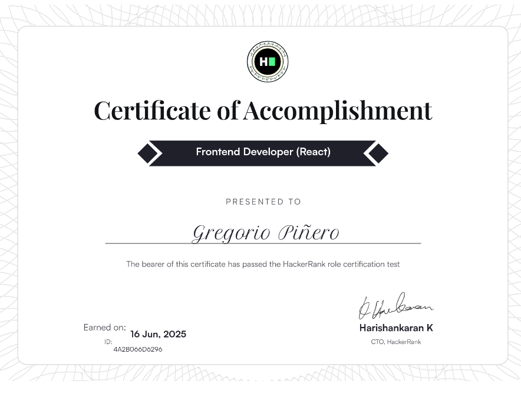
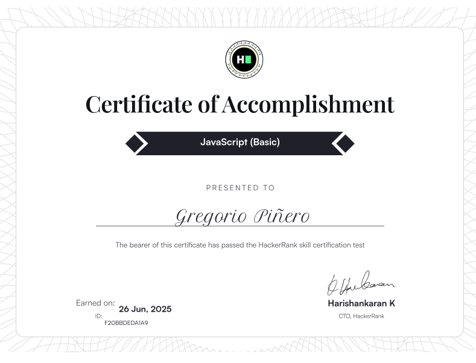

Frontend developer specialized in modern web development. I build performant, responsive and accessible user interfaces with current technologies and clean code standards.

---

## 🚀 Featured Projects

### TaskFlow

An application for project management designed to help users organize their work efficiently, both individually and collaboratively. It integrates a **cloud-based** database and user **authentication system** powered by Firebase, ensuring secure access and **real-time** data synchronization.

#### Key Fetures
-   **User Authentication:** Secure login and account management.
-   **Task Management**: Add, assign, complete tasks and subtasks within projects.
-   **Collaboration**: Work in collaboratively projects with others.
-   **Real-Time Updates**: See project changes inmediately.
-   **UX/UI**: Simple UI with cool animations/transitions and great user experience.

---

### 🎟️ Conference Ticket Generator

A dynamic ticket generator that allows users to customize and download their conference pass. Implemented a canvas rendering solution for ticket downloads.

**Tech Stack:** React · HTML2Canvas.

---

### 🛒 E-commerce Product Listing
 

Interactive product catalog with cart functionality featuring smooth animations and state management.

**Tech Stack:** React · Motion · Context API.

## 💻 Technical Skills

### Frontend

### Tools & Workflow

## 📊 GitHub Stats

---

## 📜 Certifications

    
    
    

## 📫 Let's Connect

