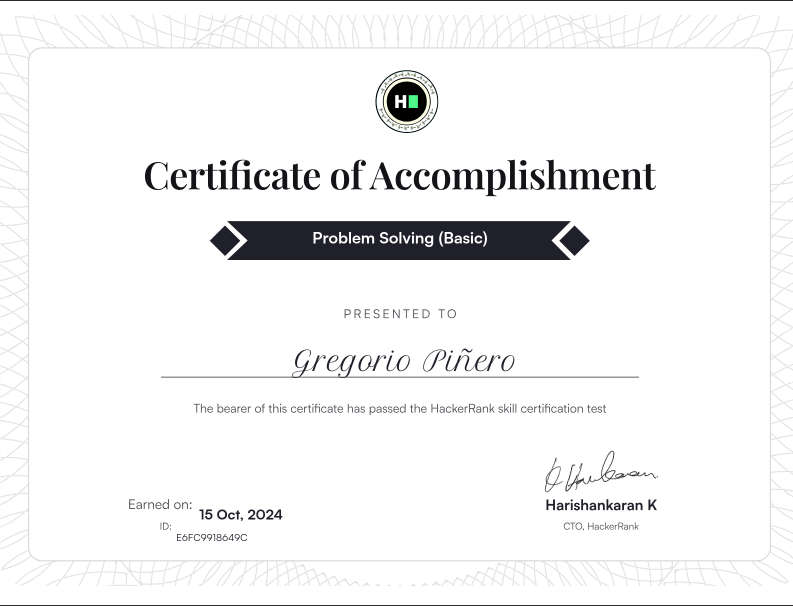

Frontend developer with multiple projects, from simple static pages to
dynamically created pages using web technologies such as **React Router** and **APIs**.

## Latests projects:

#### Conference ticket generador: [Source code](https://github.com/Grego14/conference-ticket-generator-main) | [Live site](https://grego-conference-ticket-generator.netlify.app/).

- **Build using:** HTML, CSS, React and [html2canvas](https://html2canvas.hertzen.com/).

---

#### Product list with cart: [Source Code](https://github.com/Grego14/FrontendMentor_Challenges/tree/main/challenges/product-list-with-cart-main) | [Live site](https://product-cart-with-list.netlify.app/).

- **Build using:** HTML, CSS, React, Motion, Vite and Biome.

---

### Skills

### Tools

#### Certificates

    

